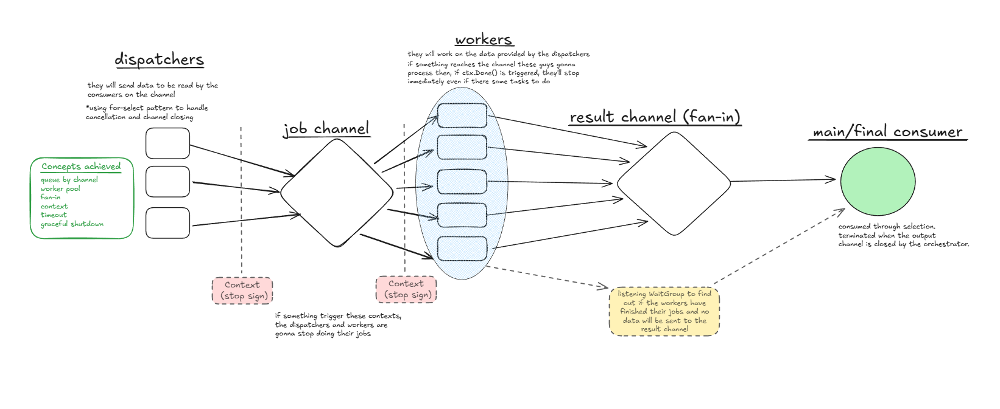

# Go Concurrency Patterns

This repository contains a collection of practical exercises and implementation patterns for high-performance concurrency in Go. It covers everything from basic goroutine synchronization to complex worker pool architectures with graceful shutdown capabilities.

## Architecture Overview

The following diagram represents the final architecture implemented in this repository. It showcases a robust Worker Pool pattern utilizing dispatchers, job channels, fan-in results, and context-driven lifecycle management.



### Key Architectural Components

* **Dispatchers**: Independent goroutines responsible for generating or sourcing tasks and feeding them into the job channel using non-blocking selection.
* **Job Channel**: A centralized queue (buffered or unbuffered) that distributes tasks among available workers.
* **Worker Pool**: A fixed set of consumer goroutines that process tasks concurrently, respecting context cancellation to prevent goroutine leaks.
* **Result Channel (Fan-in)**: A pattern where multiple workers send their processed data into a single channel for consolidated consumption.
* **Main/Final Consumer**: The orchestration point that reads final results and manages the application exit strategy.
* **Graceful Shutdown**: Coordination between `sync.WaitGroup` and `context.Context` to ensure all in-flight tasks are completed or cleaned up before the process terminates.

---

## Implemented Concepts

The repository is organized by incremental complexity, covering the following core Go concurrency primitives:

* **Goroutines and WaitGroups**: Basic execution and synchronization.
* **Channels**: Communication and data ownership between concurrent processes.
* **Select Statement**: Multiplexing asynchronous events and handling non-blocking channel operations.
* **Context (Timeout and Cancellation)**: Managing the lifecycle of goroutines and propagating signals.
* **Worker Pools**: Efficient resource management by limiting the number of active goroutines.
* **Fan-in / Fan-out**: Distributing work and consolidating results across multiple channels.
* **Signal Handling**: Capturing operating system signals (SIGINT/SIGTERM) for graceful shutdowns.

---

## Project Structure

* `08-context-timeout`: Examples of using `context.WithTimeout` to prevent hanging processes.
* `09-graceful-shutdown`: Implementing clean exits using `os/signal` and `context.NotifyContext`.
* `10-mini-project`: The final comprehensive implementation of the architecture described above.

---

## How to Run

Ensure you have Go installed on your system. Navigate to any challenge directory and run:

```bash
go run main.go
````
To test the graceful shutdown in the mini-project, initiate the program and press Ctrl+C. You will observe the workers finishing their current task before the main process exits.


---

